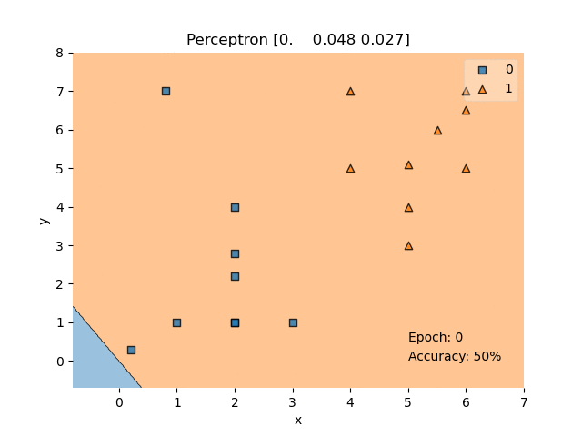

# Perceptron Learning Algorithm:
---

>Note: This code is implemented from algorithm proposed by Frank Rosenblatt in 1943, later refined and carefully analyzed by Minsky and Papert in 1969.

A single perceptron can only be used to implement linearly separable functions. It takes both real and boolean inputs and associates a set of weights to them, along with a bias.

Our goal is to find the w vector that can perfectly classify positive inputs and negative inputs in our data. I will get straight to the algorithm. Here goes:

- We initialize w with some random vector.
- We then iterate over all the examples in the data, (P U N) both positive and negative examples.
- Now if an input x belongs to P, ideally the dot product w.x be greater than or equal to 0.
- And if x belongs to N, the dot product MUST be less than 0.
---

## Steps to run the code:

1. Make sure you have Python 3.7 and a text editor installed.
2. Install the required packages using pip install -r requirements.txt.
3. In the main directory Run `python3 main.py` or `python main.py`.
4. And wait for the results.

---
## Result on the Dummy Dataset:

Result of Perceptron after Every Epoch
